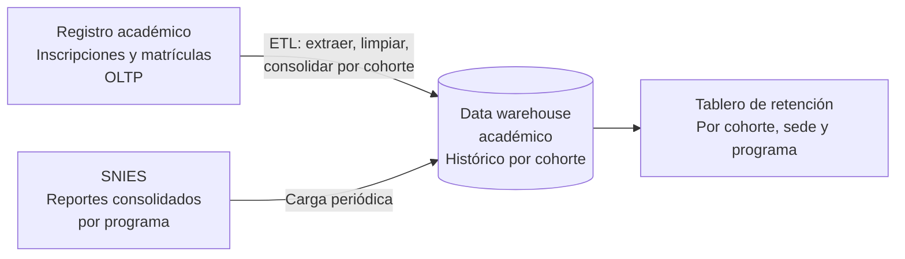

# Inteligencia de Negocios · Semana 3

**OLTP u OLAP — clasifica y justifica**
Juan José Horta Vanegas · Ingeniería de Sistemas · Unidad 1 · Corte 1 · 2026-B

---

## Los dos sistemas que elegí

Escogí uno de cada mundo, y los dos están conectados entre sí: el segundo se alimenta del primero. Eso me permite mostrar no solo la clasificación, sino el puente que hay entre ambos.

### Sistema de registro académico de la universidad → **OLTP**

Es el sistema donde los estudiantes se inscriben a materias y donde queda formalizada la matrícula de cada semestre.

Lo clasifico como transaccional por cuatro razones. Su propósito es **registrar**: que la inscripción de un estudiante quede guardada, completa y sin duplicados. Su operación típica es **insertar y actualizar** filas de a una, en el momento exacto en que alguien formaliza. Trabaja con el **estado actual** —qué materias tiene inscritas este estudiante hoy— y no con series históricas. Y sus usuarios son funcionarios de registro y los propios estudiantes, no analistas. La pregunta que ese sistema responde bien es "¿este estudiante quedó matriculado en este curso?", que es una pregunta de operación, no de análisis.

Se nota además en la carga: en semana de inscripciones recibe cientos de escrituras simultáneas y lo que se le exige es que no se caiga y no pierda ningún registro. Ningún requisito ahí tiene que ver con analizar.

### SNIES (Sistema Nacional de Información de la Educación Superior) → **OLAP**

Es el repositorio del Ministerio de Educación donde se consultan las cifras de inscritos, matriculados y graduados por institución y programa.

Aquí conviene precisar algo: el SNIES no captura matrículas. Las instituciones le **reportan periódicamente sus cifras ya consolidadas**, y ese envío periódico es, en la práctica, un ETL entre el mundo operativo de cada universidad y un repositorio nacional. Eso ya lo ubica del lado analítico.

Todo lo demás confirma la clasificación. Guarda **histórico** de varios años, no el estado del momento. Está pensado para **leer y agregar**: se consulta filtrando por año, programa, institución o región, y se compara. Sus usuarios son analistas, directivos y quienes formulan política pública. Y su pregunta típica —"¿cómo evolucionó la matrícula en ingeniería en el Huila?"— sería carísima de responder sobre las bases de producción de cada universidad por separado.

---

## La pregunta de análisis

> **¿Cómo ha evolucionado la retención a primer año de las cohortes de Ingeniería de Sistemas en los últimos cinco años, comparada por sede y frente a los demás programas de la facultad?**

Es histórica porque abarca cinco años de cohortes y no un corte del presente, y es agregada porque no pregunta por ningún estudiante en particular: pide un porcentaje calculado sobre grupos completos y luego cruzado por sede y por programa.

Vale la pena contrastarla con una pregunta que el sistema operativo **sí** puede responder, como "¿cuántos estudiantes hay matriculados este semestre en Ingeniería de Sistemas?". Esa es un conteo con un filtro sobre el estado vigente. La diferencia entre ambas es exactamente la frontera entre OLTP y OLAP.

---

## Por qué llevar esos datos a un data warehouse

**Rendimiento.** Calcular la retención de cinco cohortes obliga a recorrer todos los registros de matrícula de cinco años, estudiante por estudiante y periodo por periodo, para saber quién siguió y quién no. Mientras esa consulta corre, el sistema de registro tiene que seguir atendiendo a quien está inscribiendo materias en ese mismo instante. Es justamente el escenario donde un análisis pesado frena la operación.

**Estructura.** La información de un solo estudiante está repartida entre la tabla de personas, la de inscripciones, la de cursos y la de periodos académicos. Esa división es correcta y deliberada: así se escribe sin duplicar datos. Pero significa que cada consulta analítica tiene que unir cuatro o cinco tablas antes de empezar a contar. En un modelo dimensional, esa misma pregunta se responde con una tabla de hechos y unas pocas dimensiones.

**Histórico.** Este es el argumento decisivo en mi caso. El sistema de registro mantiene el estado vigente porque es lo que necesita para operar; no tiene ninguna razón para conservar el detalle de cohortes viejas. Pero la retención se define comparando un punto de partida con uno de llegada varios semestres después. Si ese histórico no se preserva de forma íntegra, el indicador no es que salga impreciso: no se puede calcular.

Hay un cuarto motivo que aparece al cruzar por sede y por programa. Esa comparación exige integrar datos que en la operación viven separados, y el warehouse es el único lugar donde conviven ya limpios y homogéneos.

---

## El flujo para mi caso



Si el diagrama no se ve renderizado, este es el mismo flujo en texto:

```
Registro académico (OLTP)  ─┐
                            ├── ETL ──→  Data warehouse  ──→  Tablero de retención
SNIES (reportes)           ─┘            (histórico por        (cohorte, sede,
                                          cohorte)              programa)
```

El ETL hace tres cosas concretas aquí: extrae los registros de matrícula de cada periodo, los limpia y homogeneiza —códigos de programa y de sede que cambian de nombre entre semestres—, y los consolida al nivel que necesita el análisis, que no es el estudiante individual sino la cohorte. Del otro lado, el tablero solo lee: filtra por año, sede y programa, y compara contra la meta del indicador.
