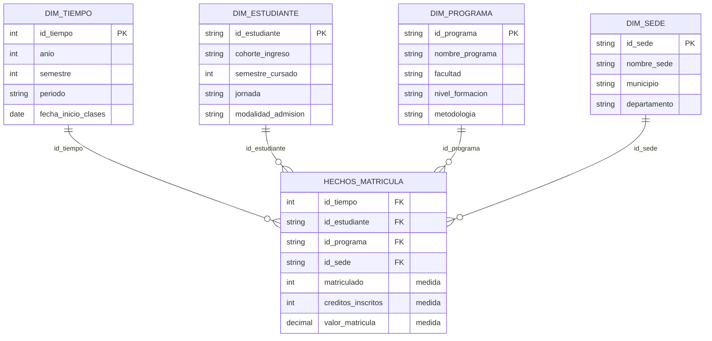

# Inteligencia de Negocios · Semana 4

**Diseña un modelo estrella en papel**
Juan José Horta Vanegas · Ingeniería de Sistemas · Unidad 1 · Corte 1 · 2026-B

---

## El proceso elegido

Matrículas. Es el proceso que vengo trabajando en las entregas anteriores y el que alimenta el indicador de retención a primer año que definí en la semana 2.

Antes de listar tablas hay que fijar el **grano**, es decir, qué representa una fila de la tabla de hechos. Aquí es:

> **Un estudiante, matriculado en un programa, en un periodo académico.**

Esa decisión manda sobre todo lo demás. Si el grano fuera "una materia inscrita" tendría un modelo más detallado pero contar estudiantes se volvería incómodo, porque un mismo estudiante aparecería seis o siete veces por semestre. Como lo que quiero medir es permanencia y no carga académica, el nivel correcto es el estudiante-periodo.

---

## Tabla de hechos: HECHOS_MATRICULA

Representa el evento de que un estudiante quede matriculado en un periodo. Cada fila es una matrícula formalizada.

| Campo | Tipo | Rol |
|---|---|---|
| `id_tiempo` | FK | Apunta a DIM_TIEMPO |
| `id_estudiante` | FK | Apunta a DIM_ESTUDIANTE |
| `id_programa` | FK | Apunta a DIM_PROGRAMA |
| `id_sede` | FK | Apunta a DIM_SEDE |
| `matriculado` | Medida | Contador aditivo, siempre 1 |
| `creditos_inscritos` | Medida | Créditos que el estudiante inscribió ese periodo |
| `valor_matricula` | Medida | Valor liquidado del semestre |

### Por qué esas medidas y no otras

Matrículas no tiene un "total" evidente como sí lo tiene ventas, así que hay que buscar qué se suma de verdad. Apliqué la prueba de la suma a cada candidato.

`matriculado` es un contador que vale 1 en cada fila. Sumarlo da el número de matrículas, y contando estudiantes distintos da la población de un periodo. Puede parecer artificial, pero es el patrón estándar cuando el hecho que importa es la **ocurrencia** del evento y no una cantidad asociada a él.

`creditos_inscritos` y `valor_matricula` sí son cantidades naturales del evento y se suman sin problema, tanto por periodo como por programa o sede.

Deliberadamente dejé fuera dos campos que suelen colarse aquí. El **semestre que cursa el estudiante** es un número, pero sumar semestres no significa nada: tiene sentido agrupar por él, así que es un atributo y lo puse en la dimensión Estudiante. Y el **promedio de créditos** no se guarda: se calcula al vuelo dividiendo la suma de créditos entre el conteo de estudiantes. Guardar un promedio rompe el modelo, porque los promedios no son aditivos y el promedio de los promedios no es el promedio real.

---

## Las dimensiones

### DIM_TIEMPO

| Atributo | Ejemplo |
|---|---|
| `id_tiempo` (PK) | 20261 |
| `anio` | 2026 |
| `semestre` | 1 |
| `periodo` | 2026-1 |
| `fecha_inicio_clases` | 2026-01-26 |

Sin esta dimensión el modelo no serviría para nada de lo que me interesa: la retención es, por definición, una comparación entre dos momentos. Es la dimensión que permite ordenar los periodos y calcular la distancia entre el ingreso de una cohorte y el punto donde se la vuelve a medir.

### DIM_ESTUDIANTE

| Atributo | Ejemplo |
|---|---|
| `id_estudiante` (PK) | E-00412 |
| `cohorte_ingreso` | 2025-1 |
| `semestre_cursado` | 3 |
| `jornada` | Diurna |
| `modalidad_admision` | Regular |

El atributo clave es `cohorte_ingreso`: marca el periodo en que el estudiante entró y no cambia nunca. Es lo que permite seguir a un grupo completo a lo largo del tiempo, que es exactamente lo que exige el indicador de retención.

### DIM_PROGRAMA

| Atributo | Ejemplo |
|---|---|
| `id_programa` (PK) | P-07 |
| `nombre_programa` | Ingeniería de Sistemas |
| `facultad` | Ingeniería |
| `nivel_formacion` | Pregrado |
| `metodologia` | Presencial |

Permite comparar el programa propio contra los demás de la facultad sin cambiar una sola línea del modelo.

### DIM_SEDE

| Atributo | Ejemplo |
|---|---|
| `id_sede` (PK) | S-02 |
| `nombre_sede` | Prado Alto |
| `municipio` | Neiva |
| `departamento` | Huila |

La separé de la dimensión Estudiante a propósito: la sede describe un lugar, no a la persona, y mantenerla aparte deja abierta la comparación geográfica sin duplicar datos en cada fila de estudiante.

---

## El diagrama



Si el diagrama no se ve renderizado, esta es la misma estrella en texto:

```
                    ┌──────────────────┐
                    │   DIM_TIEMPO     │
                    │ anio, semestre,  │
                    │ periodo          │
                    └────────┬─────────┘
                             │ id_tiempo
                             │
┌──────────────────┐   ┌─────┴──────────────┐   ┌──────────────────┐
│  DIM_ESTUDIANTE  │   │ HECHOS_MATRICULA   │   │   DIM_PROGRAMA   │
│ cohorte_ingreso, ├───┤ id_tiempo          ├───┤ nombre_programa, │
│ semestre_cursado,│   │ id_estudiante      │   │ facultad, nivel  │
│ jornada          │   │ id_programa        │   └──────────────────┘
└──────────────────┘   │ id_sede            │
                       │ matriculado    (▲) │
                       │ creditos_insc. (▲) │   (▲) = medidas
                       │ valor_matricula(▲) │
                       └─────────┬──────────┘
                                 │ id_sede
                       ┌─────────┴──────────┐
                       │      DIM_SEDE      │
                       │ nombre_sede,       │
                       │ municipio          │
                       └────────────────────┘
```

Cada dimensión está a un solo salto de los hechos. Ninguna se parte en subtablas, así que el modelo es una estrella y no un copo de nieve.

---

## Dos preguntas que este modelo responde

### 1. ¿Cuál fue la retención a primer año de cada cohorte de Ingeniería de Sistemas, comparada por sede?

Se resuelve contando estudiantes distintos de una misma `cohorte_ingreso` en dos momentos: el periodo en que ingresaron y el tercer periodo académico posterior. La división entre ambos conteos da el porcentaje de retención.

Todo lo que la pregunta necesita ya está en el modelo. `cohorte_ingreso` viene de DIM_ESTUDIANTE y define el grupo a seguir, DIM_TIEMPO ordena los periodos y permite ubicar el punto de llegada, DIM_PROGRAMA filtra Ingeniería de Sistemas y DIM_SEDE parte el resultado geográficamente. La medida es el conteo de estudiantes sobre la tabla de hechos, con una sola unión por dimensión.

### 2. ¿Cómo evolucionó el número de matriculados por programa y jornada en los últimos cinco años?

Se suma `matriculado` agrupando por `anio` de DIM_TIEMPO, por `nombre_programa` de DIM_PROGRAMA y por `jornada` de DIM_ESTUDIANTE.

Lo interesante es que es una pregunta completamente distinta a la anterior y el modelo no cambia en nada: solo se agrupa por otros atributos. Esa es la flexibilidad que da la estrella, y por eso vale la pena diseñar bien las dimensiones desde el principio en vez de armar una consulta a la medida de cada pregunta.
